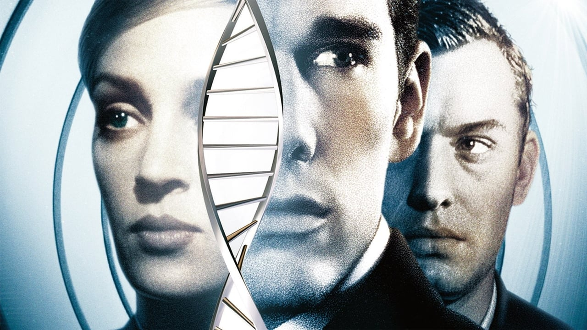

<div align="center">
   
   
</div>

# 🚀 Grupo 1 - Project Task 02 💡
<p>
    
</p>

Segunda Task correspondente ao módulo "Git", promovido pela DBC, onde o objetivo principal é aplicar a dinâmica de trabalho em grupo de forma colaborativa, através do desenvolvimento de exercícios propostos.

## Escopo
Em comum acordo, os membros do grupo optaram por escolher nomes de obras do entretenimento audiovisual de acordo com suas preferências, seguindo esses dados.

```
NOME-DO-FILME / IMAGEM 
```

# Members 👥

## [Grégori Nunes](https://github.com/gregsnn) | Gattaca
<div>
    
</div>

## [Italo Lacerda](https://github.com/italolacerda) | Rick and Morty
<div>
    
</div>

## [Luiz Fellipe](https://github.com/luizfdarb) | The Vampire Diares
<div>
    
</div>

## [Pedro Bersch](https://github.com/PedroBersch) | Oppenheimer
<div>
    
</div>

## [Pedro Pereira](https://github.com/pedrohpdo) | Interstellar
<div>
    
</div>

## [Vitor Nunes](https://github.com/VitorColombo) | Forrest Gump
<div>
    
</div>

# Docs 📚

## Branches 🔗

`feat/movies-images` - Grégori Nunes

`feat/movie-titles` - Italo Lacerda

`feat/readme-movie-desciption` - Luiz Fellipe

`feat/movie-link` - Pedro Bersch

`feat/readme` - Pedro Pereira

`feat/movies-descriptions` - Vitor Nunes

## Language 🌍
**Commits / Branches:** English
