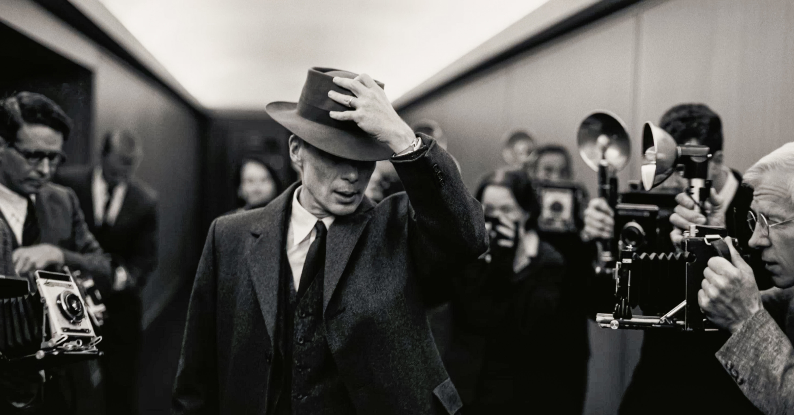

<div align="center">
   
   
</div>

# 🚀 Grupo 1 - Project Task 02 💡
<p>
    
</p>

Segunda Task correspondente ao módulo "Git", promovido pela DBC, onde o objetivo principal é aplicar a dinâmica de trabalho em grupo de forma colaborativa, através do desenvolvimento de exercícios propostos.

## Escopo
Em comum acordo, os membros do grupo optaram por escolher nomes de obras do entretenimento audiovisual de acordo com suas preferências, seguindo esses dados.

```
NOME-DO-FILME / IMAGEM / DESCRIÇÃO
```

## 👥 **Members**

## [Pedro Bersch](https://github.com/PedroBersch) | Oppenheimer
<div>
    
</div>

## [Pedro Pereira](https://github.com/pedohpdo) | Interestellar
<div>
    
</div>

## [Italo Lacerda](https://github.com/italolacerda) | Rick and Morty
<div>
    
</div>


Let's add some sparkle to our code journey! ✨✨✨